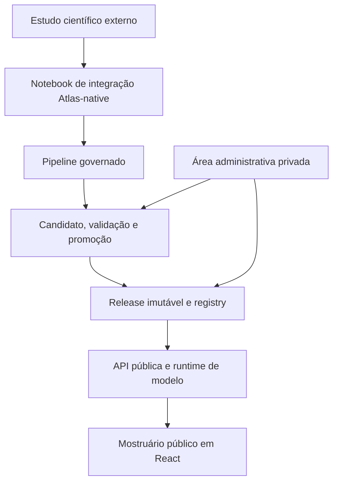

# Atlas DataFlow

**Um mostruário interativo de estudos de dados e análise preditiva.**

O Atlas DataFlow nasceu da necessidade de estudar diferentes datasets e modelos de forma organizada — e de transformar esse aprendizado em algo mais acessível do que uma coleção de notebooks isolados.

Cada dataset publicado ganha uma apresentação própria, com contexto, métricas, visualizações, documentação e, quando a capability permite, uma experiência interativa de predição. Por trás dessa apresentação existe um fluxo governado de contratos, evidências, releases e validações que mantém o estudo rastreável.

O Atlas tem aparência e ergonomia de produto, mas seu propósito é outro: **ele é um projeto pessoal de estudo e portfólio de conhecimento em dados e programação**. Não há intenção de transformá-lo em uma plataforma comercial, marketplace de modelos ou serviço de MLOps.


> O projeto está consolidando sua primeira versão pública. As quatro capabilities atualmente implementadas continuarão recebendo novos estudos antes da expansão para outras famílias de problemas.

## O que o Atlas apresenta

Para o visitante, o Atlas funciona como uma estante de estudos publicados:

- catálogo de datasets disponíveis;
- contexto do problema e origem dos dados;
- target, features, modelo e release ativa;
- métricas apresentadas de acordo com o tipo de problema;
- visualizações analíticas interativas;
- documentação técnica em Markdown;
- inferência orientada por contrato, quando aplicável à capability;
- estados de carregamento, indisponibilidade e validação sem exposição de detalhes internos.

Nem toda análise precisa ter um formulário de predição. A disponibilidade da experiência interativa é definida pela capability e pela release. O estudo de forecasting univariado, por exemplo, apresenta avaliação final, forecast versus observado e diagnósticos temporais sem expor uma inferência pública de propósito duvidoso.

## O que o Atlas não é

O Atlas não se propõe a ser:

- uma plataforma para upload público de datasets;
- um ambiente público de treinamento ou execução de notebooks;
- um marketplace de modelos;
- uma solução de AutoML;
- uma plataforma MLOps completa;
- um sistema de decisões automatizadas em produção;
- uma evidência de causalidade ou validade operacional dos modelos apresentados.

As previsões e métricas pertencem ao escopo educacional e ao protocolo de avaliação documentado em cada estudo.

## Estudos atualmente apresentados

Os projetos científicos abaixo são **repositórios independentes**. Eles fornecem a referência metodológica usada durante a autoria, mas não são pacotes, submódulos nem dependências de runtime do Atlas.

| Estudo científico | Capability no Atlas | Target | Fonte dos dados |
|---|---|---|---|
| [Telco Customer Churn](https://github.com/FabioAguiar/dataset-study-telco-customer-churn) | Classification / Binary | `Churn` | [Kaggle](https://www.kaggle.com/datasets/blastchar/telco-customer-churn) |
| [Dry Bean](https://github.com/FabioAguiar/dataset-study-dry-bean) | Classification / Multiclass | `Class` | [UCI Machine Learning Repository](https://archive.ics.uci.edu/dataset/602/dry+bean+dataset) |
| [Concrete Compressive Strength](https://github.com/FabioAguiar/dataset-study-concrete-compressives-strength) | Regression / Continuous | `Concrete compressive strength` | [UCI Machine Learning Repository](https://archive.ics.uci.edu/dataset/165/concrete+compressive+strength) |
| [Nottingham Monthly Temperatures](https://github.com/FabioAguiar/dataset-study-nottingham-monthly-temperatures) | Forecasting / Univariate | `temperature` | [R `datasets::nottem`](https://stat.ethz.ch/R-manual/R-patched/library/datasets/html/nottem.html) |

### Cobertura de problemas

| Família | Variante | Estado | Estudo atual |
|---|---|---|---|
| Classification | Binary | Disponível | Telco Customer Churn |
| Classification | Multiclass | Disponível | Dry Bean |
| Classification | Multilabel | Planejado | — |
| Classification | Ordinal | Planejado | — |
| Regression | Continuous | Disponível | Concrete Compressive Strength |
| Regression | Count | Planejado | — |
| Regression | Multi-output | Planejado | — |
| Forecasting | Univariate | Disponível | Nottingham Monthly Temperatures |
| Forecasting | Multivariate | Planejado | — |
| Forecasting | Hierarchical | Planejado | — |
| Time-to-event | Survival | Planejado | — |
| Detection | Anomaly | Planejado | — |
| Ranking | Learning to rank | Planejado | — |

“Planejado” representa direção de evolução, não promessa de prazo. A prioridade atual é aprofundar o catálogo nas quatro variantes já implementadas.

## Experiência pública

A Home apresenta o catálogo de datasets publicados. Cada card é derivado do perfil público do dataset e pode ter descrição, ícone ou imagem, tipo de problema, modelo e tema próprios.

<details>
<summary>Home e navegação responsiva</summary>


</details>

### Dataset Detail orientado pela capability

O Dataset Detail compartilha uma estrutura comum, mas adapta métricas, visualizações, target, inputs e resultados ao problema publicado.

<details>
<summary>Binary classification — Telco Customer Churn</summary>


</details>

<details>
<summary>Multiclass classification — Dry Bean</summary>


</details>

<details>
<summary>Continuous regression — Concrete Compressive Strength</summary>


</details>

<details>
<summary>Univariate forecasting — Nottingham Monthly Temperatures</summary>


</details>

<details>
<summary>Documentação e interação com gráficos</summary>


</details>

## Área administrativa privada

O Atlas também possui uma superfície administrativa para o operador que integra e publica os estudos. Essa área existe para apoiar curadoria e publicação; ela não transforma o Atlas em um produto multiusuário.

No modo privado, o operador pode:

- descobrir e pesquisar runs validadas;
- promover uma run para um novo Dataset Detail ou atualizar uma apresentação existente;
- editar conteúdo público sem alterar os contratos técnicos da release;
- configurar card da Home, ícone ou imagem, foco de performance e tema;
- organizar o formulário de inferência quando a capability admite predição pública;
- personalizar a apresentação do resultado;
- escrever e visualizar documentação em Markdown;
- comparar o draft em Live Preview com os componentes públicos reais;
- publicar snapshots determinísticos;
- aprovar a revisão do Dataset Detail;
- controlar a visibilidade do snapshot já publicado.

O admin não é exposto no build público. O modo privado habilita rotas administrativas e deve permanecer limitado a loopback, rede privada ou túnel SSH; ele não possui login público e não deve ser publicado diretamente na internet.

<details>
<summary>Dashboard, runs e promoção</summary>


</details>

<details>
<summary>Dataset Admin — Public Content</summary>


</details>

<details>
<summary>Dataset Admin — Metadata & Card</summary>


</details>

<details>
<summary>Dataset Admin — Theme Preset</summary>


</details>

<details>
<summary>Dataset Admin — Inference Form</summary>


</details>

<details>
<summary>Dataset Admin — Result Card</summary>


</details>

<details>
<summary>Dataset Admin — Documentation</summary>


</details>

<details>
<summary>Dataset Admin — Publishing</summary>


</details>

<details>
<summary>Dataset Admin — Live Preview</summary>


</details>

<details>
<summary>Settings e Help</summary>


</details>

O roteiro completo de captura, com viewport, estado esperado e cuidados de sanitização, está em [`docs/readme-screenshot-plan.md`](docs/readme-screenshot-plan.md).

## Arquitetura em poucas palavras

O Atlas separa estudo científico, autoria, publicação e consumo público.



O estudo externo pode ser consultado durante a autoria para traduzir decisões científicas já revisadas. Depois disso, o Atlas opera exclusivamente com seus próprios notebooks, contratos, evidências, modelos, bundles e releases. Nenhum runtime deve ler caminhos ou artefatos do repositório científico externo.

### Fontes de verdade

| Responsabilidade | Fonte principal |
|---|---|
| Estrutura e validação de entradas | Contratos versionados |
| Aplicabilidade por tipo de problema | Capability profile |
| Modelo, métricas e visualizações executáveis | Release imutável |
| Release ativa por dataset | Registry |
| Texto, tema, card, documentação e foco de performance | Perfil público e snapshot publicado |
| Validação e promoção | Pipeline e publisher |
| Consumo do visitante | API pública e frontend |

Uma visão técnica mais detalhada e atual está em [`docs/current-architecture-overview.md`](docs/current-architecture-overview.md). A documentação normativa e histórica permanece em [`docs/architecture.md`](docs/architecture.md), [`docs/vision.md`](docs/vision.md) e [`docs/milestones.md`](docs/milestones.md).

## Organização do repositório

```text
atlas-dataflow/
├── api/                 # API pública e operações privadas
├── contracts/           # JSON Schemas e contratos por dataset
├── docs/                # visão, arquitetura, milestones e operação
├── external-inference/  # runtime isolado para perfis incompatíveis com a API principal
├── notebooks/           # integração Atlas-native por dataset
├── pipeline/            # autoria, preparação, treino, evidências e candidatos
├── publisher/           # validação, promoção e evidências de publicação
├── registry/            # datasets, profiles, snapshots, views e estado público
├── releases/            # pacotes imutáveis promovidos
├── runtime/             # adaptação e execução de inferência
├── tests/               # regressões de contratos, pipeline, API, publisher e registry
└── web/                 # React, TypeScript, Vite e Recharts
```

A organização segue **responsabilidade arquitetural**, não extensão de arquivo. Por isso, um módulo Python e o JSON Schema que ele governa podem legitimamente existir na mesma área. Instâncias geradas, evidências, runs e releases devem permanecer em subdiretórios próprios e com lifecycle explícito; criar uma pasta global para todos os arquivos `.json` aumentaria o acoplamento e reduziria a clareza de ownership.

## Stack principal

| Área | Tecnologias |
|---|---|
| Backend e runtime | Python, FastAPI, Uvicorn, JSON Schema |
| Pipeline e modelos | Python, pandas, scikit-learn, statsmodels, joblib |
| Frontend | React, TypeScript, Vite, Recharts |
| Contratos e estado | JSON, JSON Schema, artefatos content-addressed com SHA-256 |
| Operação | Docker, Docker Compose, Nginx e proxy HTTPS externo |
| Qualidade | pytest, Vitest e validações de consistência entre artefatos |

## Executando localmente

O modo local inclui a superfície pública e o admin privado. O frontend fica ligado apenas ao loopback por padrão.

### Requisitos

- Git;
- Docker Engine;
- Docker Compose v2.

### Inicialização

```bash
git clone https://github.com/FabioAguiar/atlas-dataflow.git
cd atlas-dataflow
docker compose up --build
```

Acesse:

```text
http://127.0.0.1:15174
```

Em uma VPS, mantenha o serviço privado no loopback e use túnel SSH para a operação administrativa. O túnel é apenas um caminho de acesso privado; ele não substitui autenticação nem autoriza exposição pública do admin.

Para encerrar:

```bash
docker compose down
```

## Validação

Com as dependências de desenvolvimento instaladas:

```bash
python -m pytest -q

npm --prefix web ci
npm --prefix web test
npm --prefix web run build
```

As validações cobrem contratos, capability profiles, treinamento, bundles, runtime, API, publisher, registry, superfícies públicas e fluxos administrativos.

## Publicação de um estudo

Em alto nível, um estudo chega ao mostruário por este caminho:

1. o projeto científico registra exploração, preparação, comparação de modelos e avaliação;
2. um notebook específico do Atlas verifica o input e traduz as decisões revisadas para artefatos Atlas-native;
3. o pipeline materializa contratos, evidências, treinamento, bundle, métricas e visualizações;
4. um release candidate passa pelas validações estruturais e de consistência;
5. o publisher promove um pacote imutável;
6. o registry associa o dataset à release ativa;
7. o operador prepara o perfil, revisa o Live Preview, publica um snapshot e define a visibilidade;
8. a API e o frontend resolvem exclusivamente a publicação ativa.

O caminho continua deliberadamente governado e observável. Automatizar todas as etapas em uma única ação não é um objetivo mais importante do que preservar rastreabilidade e limites claros.

## Próximos passos

Antes de ampliar a taxonomia de problemas, a prioridade é:

- publicar novos estudos de binary classification, multiclass classification, continuous regression e univariate forecasting;
- consolidar a primeira versão pública e suas evidências de readiness;
- manter documentação, screenshots e links alinhados ao comportamento real;
- evoluir capabilities sem introduzir condições específicas por dataset no núcleo genérico;
- preservar a independência entre projetos científicos e runtime do Atlas.

Depois dessa consolidação, o projeto pode avançar gradualmente para multilabel e ordinal classification, count e multi-output regression, multivariate e hierarchical forecasting, survival analysis, anomaly detection e learning to rank.

## Documentação

- [`docs/current-architecture-overview.md`](docs/current-architecture-overview.md) — mapa técnico atual e limites entre componentes;
- [`docs/architecture.md`](docs/architecture.md) — arquitetura normativa e decisões acumuladas;
- [`docs/vision.md`](docs/vision.md) — visão e fronteiras do projeto;
- [`docs/milestones.md`](docs/milestones.md) — evolução por milestones;
- [`docs/operations/dataset-onboarding-path.md`](docs/operations/dataset-onboarding-path.md) — caminho operacional de onboarding;
- [`docs/operations/release-flow.md`](docs/operations/release-flow.md) — checklist de validação de releases;
- [`docs/readme-screenshot-plan.md`](docs/readme-screenshot-plan.md) — inventário dos screenshots deste README.

## Limites de interpretação

O Atlas organiza e apresenta estudos preditivos. Ele não converte automaticamente um bom resultado experimental em validade de produção.

Cada publicação deve ser interpretada dentro de seus próprios dados, protocolo de split ou backtesting, métricas, limitações e condições de inferência. Correlação, feature importance e desempenho preditivo não demonstram causalidade. Uso operacional exigiria validação externa, monitoramento, análise de custos de erro, avaliação de fairness quando aplicável e governança própria do domínio.

## Autor e licença

Desenvolvido por [Fábio Aguiar](https://fabioaguiar.dev/).

Distribuído sob a [MIT License](LICENSE).

