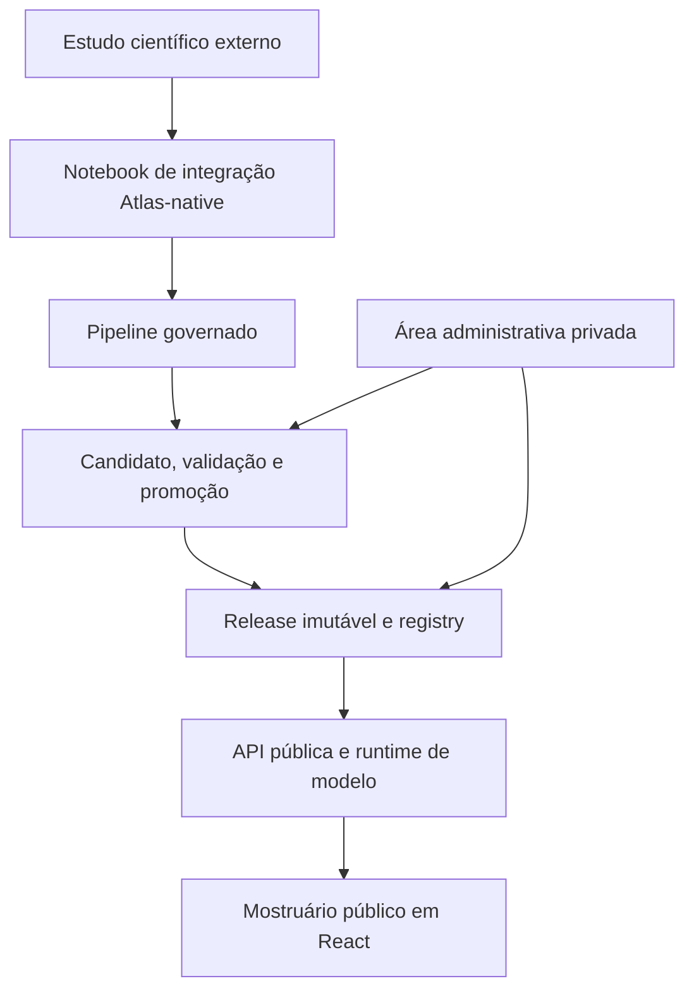

# Atlas DataFlow

**Um mostruário interativo de estudos de dados e análise preditiva.**

O Atlas DataFlow nasceu da necessidade de estudar diferentes datasets e modelos de forma organizada — e de transformar esse aprendizado em algo mais acessível do que uma coleção de notebooks isolados.

Cada dataset publicado ganha uma apresentação própria, com contexto, métricas, visualizações, documentação e, quando a capability permite, uma experiência interativa de predição. Por trás dessa apresentação existe um fluxo governado de contratos, evidências, releases e validações que mantém o estudo rastreável.

O resultado tem aparência e ergonomia de produto, mas preserva sua origem e seu propósito: **um projeto pessoal de estudo e portfólio de conhecimento em dados e programação**.


*A Home reúne os estudos disponíveis em um catálogo visual. Cada card apresenta o problema analisado e conduz ao respectivo Dataset Detail.*

> O projeto está consolidando sua primeira versão pública. As quatro capabilities atualmente implementadas continuarão recebendo novos estudos antes da expansão para outras famílias de problemas.

## O que o Atlas apresenta

Para o visitante, o Atlas funciona como uma estante de estudos publicados:

- catálogo de datasets disponíveis;
- contexto do problema e origem dos dados;
- target, features, modelo e release ativa;
- métricas apresentadas de acordo com o tipo de problema;
- visualizações analíticas interativas;
- documentação técnica em Markdown;
- inferência orientada por contrato, quando aplicável à capability;
- estados de carregamento, indisponibilidade e validação sem exposição de detalhes internos.

Nem toda análise precisa ter um formulário de predição. A disponibilidade da experiência interativa é definida pela capability e pela release. O estudo de forecasting univariado, por exemplo, apresenta avaliação final, forecast versus observado e diagnósticos temporais sem oferecer um formulário público de inferência.

## Estudos atualmente apresentados

Os projetos científicos abaixo são **repositórios independentes**. Eles fornecem a referência metodológica usada durante a autoria, mas não são pacotes, submódulos nem dependências de runtime do Atlas.

| Estudo científico | Capability no Atlas | Target | Fonte dos dados |
| --- | --- | --- | --- |
| [Telco Customer Churn](https://github.com/FabioAguiar/dataset-study-telco-customer-churn) | Classification / Binary | `Churn` | [Kaggle](https://www.kaggle.com/datasets/blastchar/telco-customer-churn) |
| [Dry Bean](https://github.com/FabioAguiar/dataset-study-dry-bean) | Classification / Multiclass | `Class` | [UCI Machine Learning Repository](https://archive.ics.uci.edu/dataset/602/dry+bean+dataset) |
| [Concrete Compressive Strength](https://github.com/FabioAguiar/dataset-study-concrete-compressives-strength) | Regression / Continuous | `Concrete compressive strength` | [UCI Machine Learning Repository](https://archive.ics.uci.edu/dataset/165/concrete+compressive+strength) |
| [Nottingham Monthly Temperatures](https://github.com/FabioAguiar/dataset-study-nottingham-monthly-temperatures) | Forecasting / Univariate | `temperature` | [R `datasets::nottem`](https://stat.ethz.ch/R-manual/R-patched/library/datasets/html/nottem.html) |

### Cobertura de problemas

| Família | Variante | Estado | Estudo atual |
| --- | --- | --- | --- |
| Classification | Binary | Disponível | Telco Customer Churn |
| Classification | Multiclass | Disponível | Dry Bean |
| Classification | Multilabel | Planejado | — |
| Classification | Ordinal | Planejado | — |
| Regression | Continuous | Disponível | Concrete Compressive Strength |
| Regression | Count | Planejado | — |
| Regression | Multi-output | Planejado | — |
| Forecasting | Univariate | Disponível | Nottingham Monthly Temperatures |
| Forecasting | Multivariate | Planejado | — |
| Forecasting | Hierarchical | Planejado | — |
| Time-to-event | Survival | Planejado | — |
| Detection | Anomaly | Planejado | — |
| Ranking | Learning to rank | Planejado | — |

“Planejado” representa direção de evolução, não promessa de prazo. A prioridade atual é aprofundar o catálogo nas quatro variantes já implementadas.

## Experiência pública

O Dataset Detail compartilha uma estrutura comum entre os estudos, mas adapta métricas, visualizações, target, inputs e resultados ao problema publicado.

### Overview analítico


*O Overview de Dry Bean combina resumo de performance, distribuição do target, importância das features e matriz de confusão. O conteúdo e os componentes são definidos pela capability de classificação multiclasse e pela release ativa.*

### Inferência orientada por contrato


*Quando a capability admite predição interativa, o formulário organiza os campos do contrato em grupos compreensíveis e apresenta o resultado do modelo com score, classificação e contexto de leitura.*

### Documentação do estudo


*A aba Documentation preserva, junto da apresentação pública, a origem dos dados, o protocolo de avaliação, as métricas, as limitações e outras informações necessárias para interpretar o estudo.*

## Área administrativa privada

O Atlas também possui uma superfície administrativa para o operador que integra, prepara e publica os estudos. Essa área existe para apoiar curadoria e publicação; ela não transforma o projeto em um produto multiusuário.

No modo privado, o operador pode:

- descobrir e pesquisar runs validadas;
- promover uma run para um novo Dataset Detail ou atualizar uma apresentação existente;
- editar conteúdo público sem alterar os contratos técnicos da release;
- configurar o card da Home, o foco de performance e o tema;
- organizar o formulário de inferência quando a capability admite predição pública;
- personalizar a apresentação do resultado;
- escrever e visualizar documentação em Markdown;
- comparar o draft em Live Preview com os componentes públicos reais;
- publicar snapshots determinísticos;
- aprovar a revisão do Dataset Detail;
- controlar a visibilidade do snapshot já publicado.

O admin não é exposto no build público. O modo privado habilita rotas administrativas e deve permanecer limitado a loopback, rede privada ou túnel SSH; ele não possui login público e não deve ser publicado diretamente na internet.

### Dashboard operacional


*O Dashboard reúne Dataset Details e runs conhecidas pelo Atlas. A partir dele, o operador acompanha estados, pesquisa registros e inicia ações de curadoria ou promoção.*

### Conteúdo público


*A aba Public Content concentra título, subtítulo, resumo do problema, fonte e informações editoriais apresentadas ao visitante, sem modificar os valores técnicos governados pela release.*

### Metadados e card da Home


*A aba Metadata & Card permite escolher a identidade visual, definir o foco de performance e revisar uma prévia do card que será exibido no catálogo público.*

### Tema do Dataset Detail


*Os presets de tema ajustam a identidade cromática da apresentação sem alterar a estrutura analítica nem os contratos do estudo.*

### Organização do formulário de inferência


*Para capabilities com inferência pública, o operador pode agrupar, ordenar e revisar os campos que compõem o formulário. A disponibilidade da aba continua sendo determinada pelo contrato da capability.*

### Autoria da documentação


*A documentação é escrita em Markdown na área administrativa e publicada como parte do snapshot revisado do Dataset Detail.*

## Arquitetura em poucas palavras

O Atlas separa estudo científico, autoria, publicação e consumo público.



O estudo externo pode ser consultado durante a autoria para traduzir decisões científicas já revisadas. Depois disso, o Atlas opera exclusivamente com seus próprios notebooks, contratos, evidências, modelos, bundles e releases. Nenhum runtime deve ler caminhos ou artefatos do repositório científico externo.

O fluxo foi desenhado para a autoria curada dos estudos do portfólio. Upload público de datasets, execução pública de notebooks, AutoML, marketplace de modelos e operação MLOps de propósito geral não fazem parte de seu escopo. A governança existente serve à rastreabilidade das análises publicadas no próprio mostruário.

### Fontes de verdade

| Responsabilidade | Fonte principal |
| --- | --- |
| Estrutura e validação de entradas | Contratos versionados |
| Aplicabilidade por tipo de problema | Capability profile |
| Modelo, métricas e visualizações executáveis | Release imutável |
| Release ativa por dataset | Registry |
| Texto, tema, card, documentação e foco de performance | Perfil público e snapshot publicado |
| Validação e promoção | Pipeline e publisher |
| Consumo do visitante | API pública e frontend |

Uma visão técnica mais detalhada e atual está em [`docs/current-architecture-overview.md`](docs/current-architecture-overview.md). A documentação normativa e histórica permanece em [`docs/architecture.md`](docs/architecture.md), [`docs/vision.md`](docs/vision.md) e [`docs/milestones.md`](docs/milestones.md).

## Organização do repositório

```text
atlas-dataflow/
├── api/                 # API pública e operações privadas
├── contracts/           # JSON Schemas e contratos por dataset
├── docs/                # visão, arquitetura, milestones e operação
├── notebooks/           # integração Atlas-native por dataset
├── pipeline/            # autoria, preparação, treino, evidências e candidatos
├── publisher/           # validação, promoção e evidências de publicação
├── registry/            # datasets, profiles, snapshots, views e estado público
├── releases/            # pacotes imutáveis promovidos
├── runtime/             # adaptação e execução de inferência
├── tests/               # regressões de contratos, pipeline, API, publisher e registry
└── web/                 # React, TypeScript, Vite e Recharts
```

A organização segue **responsabilidade arquitetural**, não extensão de arquivo. Por isso, um módulo Python e o JSON Schema que ele governa podem legitimamente existir na mesma área. Instâncias geradas, evidências, runs e releases devem permanecer em subdiretórios próprios e com lifecycle explícito; criar uma pasta global para todos os arquivos `.json` aumentaria o acoplamento e reduziria a clareza de ownership.

## Stack principal

| Área | Tecnologias |
| --- | --- |
| Backend e runtime | Python, FastAPI, Uvicorn, JSON Schema |
| Pipeline e modelos | Python, pandas, scikit-learn, statsmodels, joblib |
| Frontend | React, TypeScript, Vite, Recharts |
| Contratos e estado | JSON, JSON Schema, artefatos content-addressed com SHA-256 |
| Operação | Docker, Docker Compose, Nginx e proxy HTTPS externo |
| Qualidade | pytest, Vitest e validações de consistência entre artefatos |

## Executando localmente

O modo local inclui a superfície pública e o admin privado. O frontend fica ligado apenas ao loopback por padrão.

### Requisitos

- Git;
- Docker Engine;
- Docker Compose v2.

### Inicialização

```bash
git clone https://github.com/FabioAguiar/atlas-dataflow.git
cd atlas-dataflow
docker compose up --build
```

Acesse:

```text
http://127.0.0.1:15174
```

Em uma VPS, mantenha o serviço privado no loopback e use túnel SSH para a operação administrativa. O túnel é apenas um caminho de acesso privado; ele não substitui autenticação nem autoriza exposição pública do admin.

Para encerrar:

```bash
docker compose down
```

## Validação

Com as dependências de desenvolvimento instaladas:

```bash
python -m pytest -q
npm --prefix web ci
npm --prefix web test
npm --prefix web run build
```

As validações cobrem contratos, capability profiles, treinamento, bundles, runtime, API, publisher, registry, superfícies públicas e fluxos administrativos.

## Publicação de um estudo

Em alto nível, um estudo chega ao mostruário por este caminho:

1. o projeto científico registra exploração, preparação, comparação de modelos e avaliação;
2. um notebook específico do Atlas verifica o input e traduz as decisões revisadas para artefatos Atlas-native;
3. o pipeline materializa contratos, evidências, treinamento, bundle, métricas e visualizações;
4. um release candidate passa pelas validações estruturais e de consistência;
5. o publisher promove um pacote imutável;
6. o registry associa o dataset à release ativa;
7. o operador prepara o perfil, revisa o Live Preview, publica um snapshot e define a visibilidade;
8. a API e o frontend resolvem exclusivamente a publicação ativa.

O caminho continua deliberadamente governado e observável. Automatizar todas as etapas em uma única ação não é um objetivo mais importante do que preservar rastreabilidade e limites claros.

## Próximos passos

Antes de ampliar a taxonomia de problemas, a prioridade é:

- publicar novos estudos de binary classification, multiclass classification, continuous regression e univariate forecasting;
- consolidar a primeira versão pública e suas evidências de readiness;
- manter documentação, screenshots e links alinhados ao comportamento real;
- evoluir capabilities sem introduzir condições específicas por dataset no núcleo genérico;
- preservar a independência entre projetos científicos e runtime do Atlas.

Depois dessa consolidação, o projeto pode avançar gradualmente para multilabel e ordinal classification, count e multi-output regression, multivariate e hierarchical forecasting, survival analysis, anomaly detection e learning to rank.

## Documentação

- [`docs/current-architecture-overview.md`](docs/current-architecture-overview.md) — mapa técnico atual e limites entre componentes;
- [`docs/architecture.md`](docs/architecture.md) — arquitetura normativa e decisões acumuladas;
- [`docs/vision.md`](docs/vision.md) — visão e fronteiras do projeto;
- [`docs/milestones.md`](docs/milestones.md) — evolução por milestones;
- [`docs/operations/dataset-onboarding-path.md`](docs/operations/dataset-onboarding-path.md) — caminho operacional de onboarding;
- [`docs/operations/release-flow.md`](docs/operations/release-flow.md) — checklist de validação de releases.

## Limites de interpretação

O Atlas organiza e apresenta estudos preditivos. Um bom resultado experimental não implica automaticamente validade de produção.

Cada publicação deve ser interpretada dentro de seus próprios dados, protocolo de split ou backtesting, métricas, limitações e condições de inferência. Correlação, feature importance e desempenho preditivo não demonstram causalidade. Uso operacional exigiria validação externa, monitoramento, análise de custos de erro, avaliação de fairness quando aplicável e governança própria do domínio.

## Autor e licença

Desenvolvido por [Fábio Aguiar](https://fabioaguiar.dev/).

Distribuído sob a [MIT License](LICENSE).
