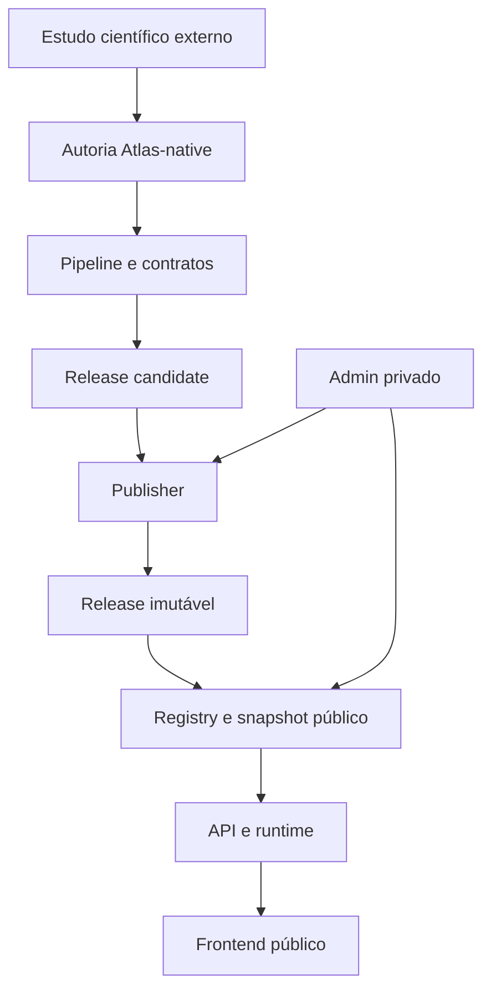

# Atlas DataFlow — Current Architecture Overview

> Snapshot documental baseado no estado auditado em 31 de agosto de 2026. Este documento descreve o comportamento implementado; decisões normativas e histórico de evolução permanecem em `docs/architecture.md`, `docs/vision.md` e `docs/milestones.md`.

## 1. Propósito e fronteira

Atlas DataFlow é uma camada de publicação para estudos pessoais de datasets e análise preditiva. Seu produto final é uma experiência web por dataset, composta por contexto, métricas, visualizações, documentação e, quando aplicável, interação preditiva.

O projeto deliberadamente possui uma interface com qualidade de produto, porém não é uma plataforma comercial, multi-tenant ou de MLOps. O admin atende um operador privado responsável por integrar, revisar e publicar os próprios estudos.

## 2. Estado atual

- Milestone operacional ativo: `M49 — First-Version Release Readiness and Evidence Gate`.
- Último milestone concluído: `M48 — Design Acceptance Gap Reduction Pass`.
- Capabilities com perfil `current_supported`:
  - `binary-predictive-classification.v1`;
  - `multiclass-predictive-classification.v1`;
  - `continuous-predictive-regression.v1`;
  - `univariate-predictive-forecasting.v1`.
- Datasets públicos registrados:
  - `telco-customer-churn`;
  - `dry-bean`;
  - `concrete-compressive-strength`;
  - `nottem`.
- Cada dataset possui uma release ativa explícita no registry.
- O frontend oferece Home pública, Dataset Detail e área administrativa privada.
- O forecasting univariado pode declarar a predição pública como não aplicável; nesse caso o Dataset Detail omite a aba Inference e apresenta avaliação e diagnósticos.

## 3. Fluxo arquitetural

### 3.1 Estudo científico externo

O estudo externo é uma referência de autoria. Ele possui notebooks, scripts, testes e evidências próprios para exploração, preparação, comparação de famílias, seleção e avaliação final.

O Atlas pode consultá-lo enquanto traduz conclusões científicas revisadas, mas não deve:

- importar o projeto como pacote de runtime;
- montar seu diretório em produção;
- ler seus paths, artifacts, evidence ou model bytes durante inferência;
- depender da continuidade do layout externo após a autoria.

### 3.2 Notebook de integração

Cada dataset possui um notebook canônico em `notebooks/datasets/<dataset>/dataset_integration.ipynb`. Ele é a superfície humana de orquestração da integração e deve reutilizar os módulos genéricos do pipeline.

O notebook verifica o input Atlas-owned, registra intenção semântica, materializa artefatos governados e conduz a geração de uma run validada. Ele não deve concentrar regras genéricas, promover releases silenciosamente ou manter estado durável apenas na memória do kernel.

### 3.3 Pipeline

`pipeline/` materializa e valida:

- discovery evidence;
- semantic intent;
- preparação e splits/backtesting;
- capability profile;
- contratos público, de execução e de runtime;
- training records e model cards;
- métricas e visualizações;
- model artifact e inference bundle;
- release candidate e resultado terminal da run.

O comportamento genérico é selecionado por capability, não por condições do tipo `if dataset_slug == ...`.

### 3.4 Publisher e release

`publisher/` valida consistência, hashes, completude e compatibilidade antes de promover um candidate.

Uma release promovida é um pacote imutável que reúne contratos, bundle, modelo, métricas, model card, contexto e visualizações. O runtime resolve o modelo a partir da release ativa; não existe dependência operacional em um model store paralelo do estudo externo.

### 3.5 Registry e publicação editorial

`registry/` possui responsabilidades distintas:

- identidade pública do dataset;
- `active_release` explícita;
- predict views e customizações;
- profile draft privado;
- snapshot público publicado;
- visibilidade do snapshot;
- evidências e stores de estado.

O perfil editorial pode alterar título, texto, tema, card, documentação e apresentação. Ele não pode redefinir target, feature names, tipos, validação, semântica do resultado ou comportamento do modelo.

### 3.6 API e runtime

`api/` serve endpoints públicos para catálogo, Dataset Detail, contrato, métricas, contexto, model card, visualizações, views e inferência. Também expõe operações administrativas somente quando `ATLAS_ADMIN_ENABLED=true`.

O processo principal da API é o runtime de inferência canônico. `runtime/inference.py` é o boundary governado de carregamento e execução, e `api/` resolve release, manifest, bundle e contrato antes de delegar a ele — não há um segundo serviço de inferência nem um cliente HTTP interno. O pacote de release é o boundary de ownership do modelo. Um modelo ou runtime incompatível é bloqueado/reconciliado no gate, nunca despachado para um serviço alternativo.

### 3.7 Frontend

`web/` implementa:

- Home pública;
- Dataset Detail orientado pela release e capability;
- métricas, visualizações e tooltips adaptativos;
- formulários e resultados por tipo de problema;
- documentação Markdown;
- Dashboard privado;
- Dataset Admin com oito áreas de curadoria;
- Settings e Help.

Os componentes de Live Preview reutilizam os mesmos componentes públicos, evitando uma segunda implementação visual divergente.

## 4. Superfícies e rotas

### Públicas

| Rota | Responsabilidade |
|---|---|
| `/` | catálogo de datasets publicados |
| `/dataset/:slug` | Dataset Detail |
| `/dataset/:slug/view/:viewId` | view preditiva específica |

O Dataset Detail possui `Overview`, `Inference` e `Documentation` quando a release declara predição pública disponível. Quando a capability indica `not_applicable`, a aba `Inference` é omitida.

### Privadas

| Rota | Responsabilidade |
|---|---|
| `/admin/dashboard` | runs, Dataset Details e promoção |
| `/admin/dataset-detail` | curadoria e publicação |
| `/admin/settings` | nome exibido do operador |
| `/admin/help` | orientação do fluxo administrativo |

`/admin` redireciona para o Dashboard. `/admin/dataset-admin` é um alias legado que redireciona para `/admin/dataset-detail`.

## 5. Abas do Dataset Admin

| Aba | Responsabilidade |
|---|---|
| Public Content | título, subtítulo, resumo, fonte e data editorial |
| Metadata & Card | ícone/imagem, descrição da Home e foco de performance |
| Theme Preset | seleção de tokens visuais controlados |
| Inference Form | composição do formulário público sem alterar o contrato técnico |
| Result Card | copy e apresentação do resultado por capability |
| Documentation | edição e preview de Markdown |
| Publishing | visibilidade, aprovação e console operacional |
| Live Preview | preview real do Dataset Detail ou card da Home |

`Inference Form` e `Result Card` são ocultadas quando a capability não oferece autoria de predição pública. Estado editorial dormente pode ser preservado sem ser exposto.

## 6. Autoridade dos artefatos

| Artefato | Autoridade |
|---|---|
| Capability profile | aplicabilidade de roles e modo de runtime/publicação |
| Execution/runtime/public contract | schema, validação, input e projeção pública segura |
| Inference bundle | feature order, preprocessing, modelo e output |
| Model card e metrics | evidência reduzida da release |
| Visualizations | dados analíticos públicos governados |
| Release manifest | integridade e referências content-addressed |
| Registry | dataset e release ativa |
| Profile draft | edição privada |
| Published snapshot | apresentação pública determinística |
| Visibility record | exposição pública do snapshot |

## 7. Modos de execução

### Privado/local

`docker-compose.yml` habilita admin no backend e no frontend e publica o web apenas em `127.0.0.1:15174` por padrão. É apropriado para operação local ou por túnel SSH.

### Público

`docker-compose.prod.yml` desabilita admin no backend e no build web. O stack expõe serviços apenas para composição com uma camada de proxy/rede externa. HTTPS, domínio público e certificados válidos devem ser fornecidos pelo ambiente de deployment; o `Caddyfile` versionado usa TLS interno e não representa uma configuração pronta para internet.

Não existe login público no admin. Portanto, habilitar o admin e expô-lo diretamente à internet é uma configuração inválida para a primeira versão.

## 8. Organização de `.py` e `.json`

Separar arquivos apenas por extensão não é recomendado. `pipeline/`, `publisher/` e `registry/` são bounded areas: os módulos Python, schemas, exemplos e pequenos documentos de configuração possuem ownership comum e podem ser revisados atomicamente.

A separação que realmente importa é por função e lifecycle:

- schemas e configurações estáveis;
- código produtor/validador/consumer;
- instâncias por dataset;
- runs geradas;
- evidências;
- candidates;
- releases imutáveis;
- estado editorial mutável.

O repositório já aplica boa parte dessa separação com subdiretórios como `pipeline/capabilities/`, `pipeline/evidence/`, `pipeline/training-runs/`, `publisher/runs/`, `registry/profile-snapshots/` e `releases/`.

Uma migração ampla para `schemas/` ou `state/` dentro de cada área pode ser considerada no futuro se a navegação continuar difícil, mas não é uma correção obrigatória antes da abertura pública. Muitos paths são parte de contratos, manifests, testes e hashes; mover arquivos agora teria custo de compatibilidade desproporcional. O ganho imediato mais seguro é documentar ownership e adicionar READMEs locais às áreas com maior densidade.

Nunca criar um diretório global `json/`: ele misturaria schemas, configuração, evidência, estado mutável e pacotes de release que possuem lifecycle e responsáveis diferentes.

## 9. Estado de documentação e readiness observado

Antes da abertura pública, revisar pelo menos:

1. substituir o README operacional antigo pelo README público;
2. preencher as URLs reais do repositório em `web/src/pages/HomePage.tsx` e `web/src/layouts/PublicShell.tsx`, que ainda usam `<owner>/<atlas-repo>`;
3. atualizar afirmações históricas em `docs/architecture.md` que dizem que apenas binary classification está operacional;
4. reconciliar o texto de `HelpPage.tsx`, que ainda descreve a promoção do Dashboard como futura/desabilitada, com o endpoint e a UI atuais;
5. definir deployment público real com domínio e certificado válidos, pois o Caddyfile atual usa `tls internal`;
6. executar as suítes Python e frontend em ambientes com dependências instaladas;
7. capturar e publicar os screenshots enumerados em `docs/readme-screenshot-plan.md`;
8. verificar que nenhum admin route ou admin API esteja acessível no build público.

Esses itens são de documentação e release readiness; não alteram a arquitetura central confirmada.

## 10. Referências

- `docs/architecture.md` — decisões normativas e arquitetura acumulada;
- `docs/vision.md` — propósito e não objetivos;
- `docs/milestones.md` — evolução planejada;
- `docs/project-status/milestone-state.json` — cursor operacional;
- `docs/operations/dataset-onboarding-path.md` — narrativa de onboarding;
- `docs/operations/release-flow.md` — checklist de release;
- `pipeline/capabilities/` — capabilities atualmente contratadas;
- `registry/datasets.json` — datasets e releases ativas.

